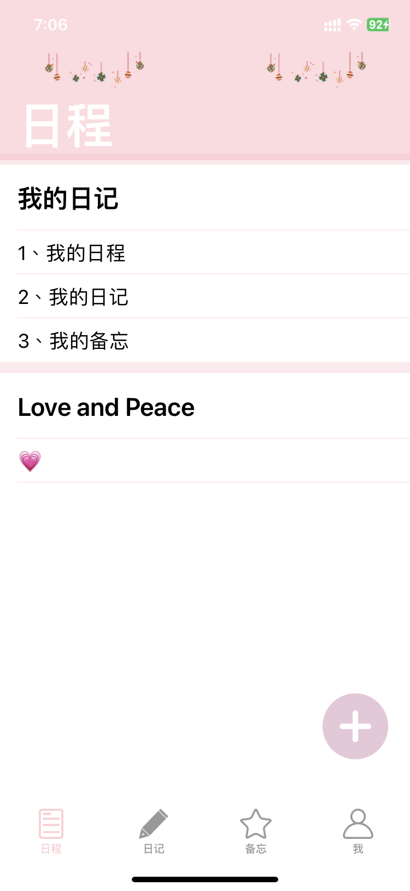
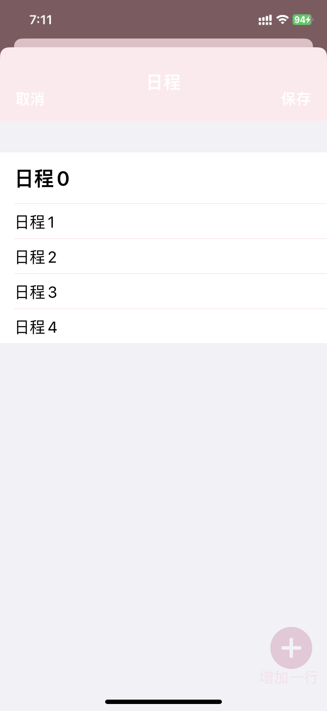
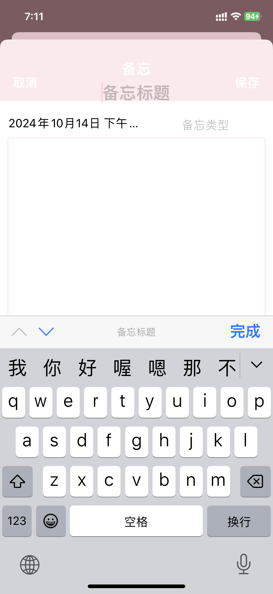
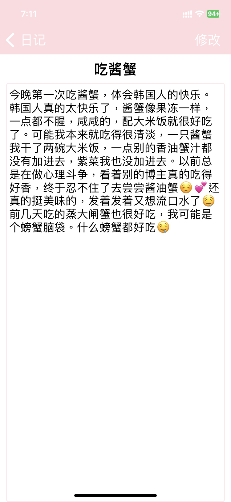

# MyNote
### 项目介绍

MyNote，本应用主要功能是记录我的日程、日记、备忘。

我一直都想开发一款风格温暖、带有少女感的app来记录自己的生活，希望线条没有这么硬朗，风格比较温暖一些，这就是《MyNote》诞生的初衷。

MyNote为用户提供一个简洁而温馨的日程管理体验。设计上追求清新简约的同时，注重提升用户的使用便捷性，避免任何不必要的复杂操作。

### 项目学习
本应用主要是学习到TableView的使用和Sqlite数据库使用，使用了第三方库FMDB、MBProgressHUD。

### 应用截图

|  |  |
| ----- | ----- |
|  |  |
|  |  |
|  |  |
|  |  |

### 项目启动

需要连接真机。
